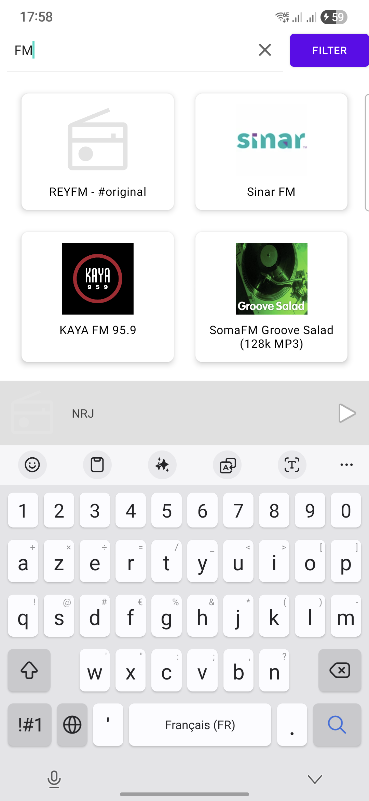
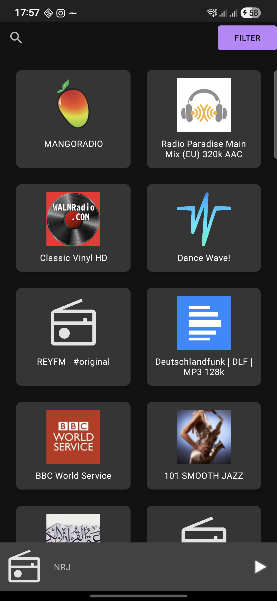

# Radioto

Radioto is a simple and clean internet radio player for Android. It allows you to discover, filter, and listen to radio stations from all over the world.

## 📸 Screenshots

| Light Mode | Dark Mode |
| :---: | :---: |
|  |  |

## ✨ Features

- **Discover Stations:** Browse a vast collection of internet radio stations.
- **Filter by Country:** Easily filter the station list to find stations from a specific country.
- **Search:** Quickly find stations by name.
- **Modern UI:** A clean user interface built with Material Design.
- **Light & Dark Theme:** The app automatically adapts to your device's theme.
- **Custom Mini-Player:** A sleek, custom player at the bottom of the screen shows the currently playing station's logo and name, along with a play/pause control.

## 🛠️ Technologies & Libraries Used

- **Language:** [Kotlin](https://kotlinlang.org/)
- **Core:** Android SDK, [AndroidX Libraries](https://developer.android.com/jetpack/androidx)
- **Audio Playback:** [Android Media3](https://developer.android.com/guide/topics/media/media3)
- **Networking:** [Retrofit 2](https://square.github.io/retrofit/) for REST API communication.
- **Image Loading:** [Glide](https://github.com/bumptech/glide)
- **UI:** [Material Design Components](https://material.io/develop/android), RecyclerView, ConstraintLayout.

## 📡 API

This application uses the free and open-source [Radio Browser API](https://api.radio-browser.info/) to fetch the list of radio stations.

## 🚀 How to Build

1.  Clone the repository.
2.  Open the project in [Android Studio](https://developer.android.com/studio).
3.  Let Gradle sync the dependencies.
4.  Build and run the application.

## 💻 Downloads

You can download the latest version of the application from the [GitHub Releases](https://github.com/Antoine-Becquet/Radioto/releases) page.

## 📄 License

*(You should choose a license for your project, for example, MIT or Apache 2.0)*
